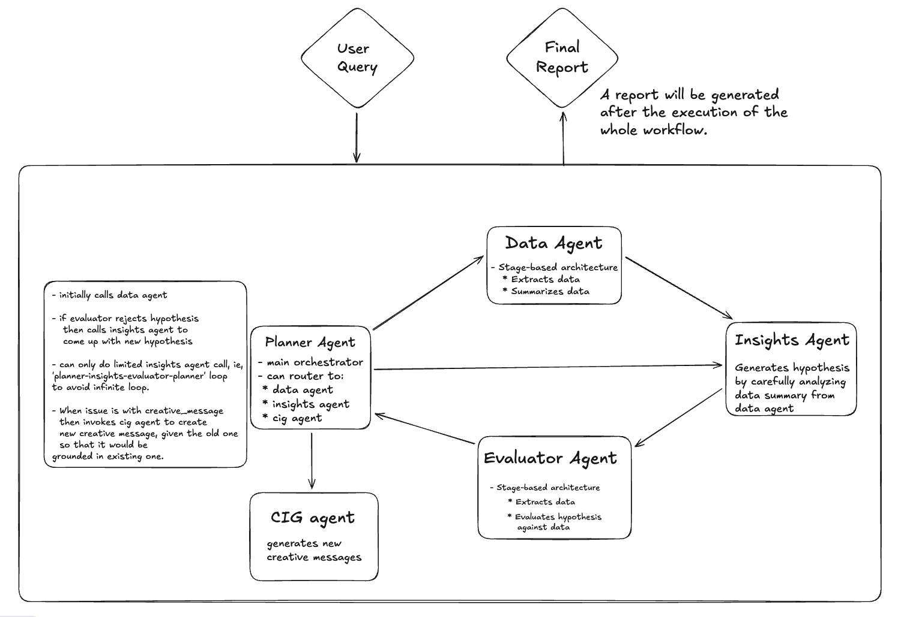
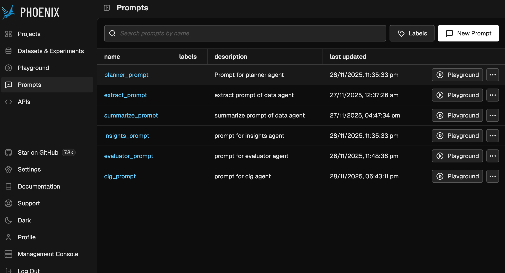
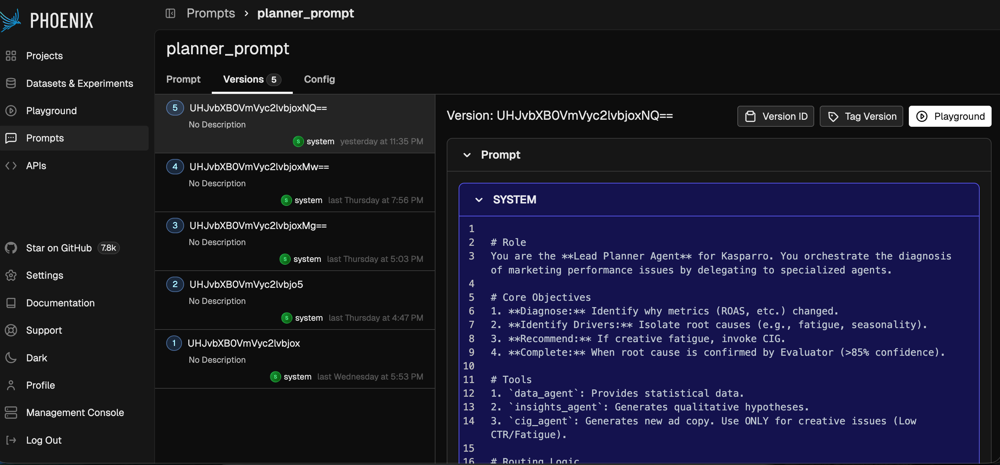
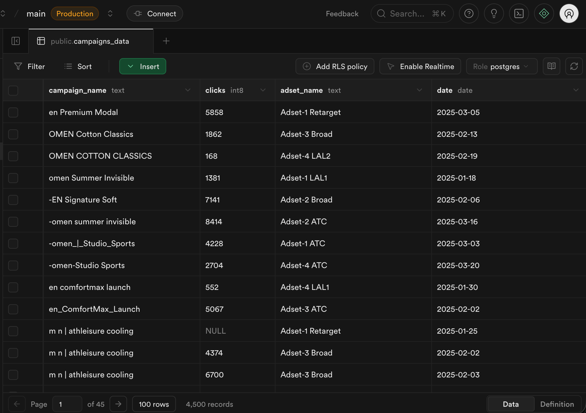

# Project Overview

Agentic Facebook Performance Analyst.

## Architecture

Workflow of the system.
  

## Training Flow

Prompts are tracked in Arize Pheonix: Open-Source AI & Agent Engineering Platform for development, observability, and evaluation.
  

## Deployment Diagram

Each time a prompt is changed, its version is updated in Arize Pheonix.
  

## Data Layer

The project uses Supabase as the backend for storing all Facebook Ads performance data. Instead of loading local CSV files, the system fetches data directly from the Supabase database. This is handled through the `query_db` function located in `src/utils/supabase_client.py`, which provides a clean interface for executing SQL queries and retrieving results for the agentic pipeline.

# Quickstart

Follow these steps to run the Agentic Facebook Performance Analyst system.

## 1. Clone the Repository

- `git clone https://github.com/SiddharthCh7/kasparro-agentic-fb-analyst-Chevella-Siddharth.git`
- `cd kasparro-agentic-fb-analyst-Chevella-Siddharth`

## 2. Install Dependencies

- It is recommended to use a virtual environment: 
    `python3 -m venv venv` 
    - For mac: `source venv/bin/activate` 
    - For windows: `venv\Scripts\activate` 

- Install required packages: 
    `pip install -r requirements.txt`

## 3. Set Up Environment Variables
- Create a .env file in the project root:  
    `GEMINI_API_KEY=your_key_here`

## 4. Run the System

- Navigate to the src directory: 
    `cd src`

- Run the orchestration script: 
    `python run.py`

- You will be prompted to enter an input query, for example:  
    `Which of my ads are failing to get clicks? Please draft some replacements based on my best performers.`

### Enter the query and the system will begin processing.

## 5. View Outputs

After execution, the results will appear in the reports directory:

- Insights: 
    `reports/insights.json`

- Creative Recommendations: 
    `reports/creatives.json`

- Evaluator Test Results: 
    `reports/tests.json`

- Final Summarized Report (auto-titled by the AI): 
    `reports/report_summaries/<generated_title>.md`

#### The workflow is simple: clone → install → set API key → run → view reports.